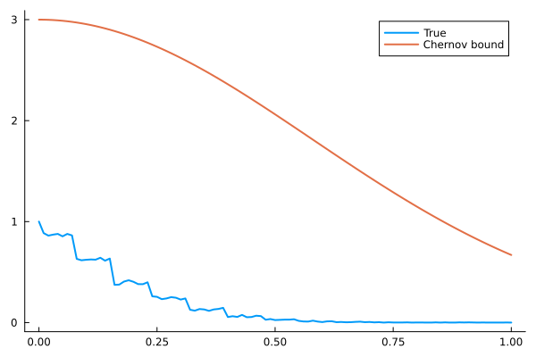

# CSE 382M: Foundational Techniques in Machine Learning & Data Science

__Reference Textbooks__: Foundations of Data Science Avrim Blum, John Hopcroft (online version up there)

# High Dimensions

Understanding high-dimensional spaces, such as $\mathbb{R}^d$, is important in various areas of machine learning and data analysis. As $d$ approaches infinity, the nature of the space can become difficult to comprehend.

For example, consider images with dimensions $1024 \times 1024$, where the dimensionality $d$ equals the number of pixels in the image.

In order to explore and understand high-dimensional spaces, we can use random vectors to sample this space:

Let $X$ be a random vector, where the squared norm (magnitude) of the vector $X$ is represented as $|X|^2 = \sum^d_{i} x_i^2$. The norm is essentially the sum of the squares of the random scalar components.

Algorithms in machine learning and data analysis are often initialized randomly in $\mathbb{R}^n$, which makes understanding the behavior of random variables in high-dimensional spaces crucial.

#### Random Variables:

There are various types of random variables, such as Gaussian, Bernoulli, etc. The Gaussian (normal) distribution is defined by the probability density function:
$$
\frac{1}{2\pi\sigma} \exp{(-\frac{(x-\mu)^2}{\sigma^2})}
$$
where $\mu$ is the mean and $\sigma$ is the standard deviation of the distribution.

Other common random variables, like the Bernoulli distribution, describe different types of probabilistic behavior and are useful for understanding the properties and implications of high-dimensional spaces.

## Expectation/Expected Value:

Discrete:

$$
\mathbb{E}(X) = \sum_i \mathbb{P}(X=x_i) x_i
$$

Continuous

$$
\mathbb{E}(X) = \int p(x) x dx
$$

Gaussian mean value:

$$
\begin{align}
\mathbb{E}(X) &= \int p(x) x dx \\
&= \int \frac{1}{\sqrt{2\pi}} \exp(-\frac{(x-\mu)^2}{2}) x dx \\
&\textrm{ Transform } x' = x - \mu \\
&= \int_{-\infty}^{\infty} \frac{1}{\sqrt{2\pi}} \exp(-\frac{(x')^2}{2}) (x' + \mu) dx' \\
&= \int_{-\infty}^{\infty} \frac{1}{\sqrt{2\pi}} \exp(-\frac{(x')^2}{2}) (x') dx'  + \int_{-\infty}^{\infty} \frac{1}{\sqrt{2\pi}} \exp(-\frac{(x')^2}{2}) (\mu) dx'\\
&\textrm{First term is 0 because x' is odd} \\
&= 0  + \mu \int_{-\infty}^{\infty} \frac{1}{\sqrt{2\pi}} \exp(-\frac{(x')^2}{2}) dx'\\
&= \mu \\
\implies \mathbb{E}(X) &= \mu
\end{align}
$$
Gaussian Integral:
$$
\begin{align}
I &= \int_{-\infty}^{\infty} \frac{1}{\sqrt{2\pi}} \exp(-\frac{x^2}{2}) dx \\
I^2 &= \int_{-\infty}^{\infty}  \int_{-\infty}^{\infty} \frac{1}{\sqrt{2\pi}} \exp(-\frac{x^2}{2}) \frac{1}{\sqrt{2\pi}} \exp(-\frac{y^2}{2}) dx dy \\
I^2 &= \frac{1}{2\pi} \int_{-\infty}^{\infty}  \int_{-\infty}^{\infty}  \exp(-\frac{x^2 + y^2}{2})  dx dy \\
I^2 &= \frac{1}{2\pi} \int_{0}^{2\pi}  \int_{0}^{\infty}  \exp(-\frac{r^2}{2})  r dr d\theta \\
I^2 &= \frac{2\pi}{2\pi}  \int_{0}^{\infty}  \exp(-\frac{r^2}{2})  r dr d\theta \\
I^2 &= \frac{2\pi}{2\pi}  \int_{0}^{\infty}  \exp(-\frac{r^2}{2})  r dr \\
I^2 &=  \int_{0}^{\infty}  \exp(-u)  du \\
I^2 &=  1 \\
\implies I &= 1
\end{align}
$$

### Properties of Expectations

$$
\begin{align}
\mathbb{E}(cX) &= c\mathbb{E}(X) \\
\mathbb{E}(X + Y) &= \mathbb{E}(X) + \mathbb{E}(Y) \\
\mathbb{E}(X \times Y) &= \mathbb{E}(X)\mathbb{E}(Y) \textrm{ only if X and Y are independent} \\
\mathbb{E}(f(X)) &= \int f(x)p(x)dx \\
\end{align}
$$

> __Note__: You can take any random variable $X$ , and transform it using any deterministic function $f$, and get another random variable. $Y = f(X) $. This makes $Y$ also a random variable. 
>
> In addition $f(X)$ and $g(Y)$ are independent if $X$ and $Y$ are independent. 

### Variance of random variable

$$
\begin{align}
\textrm{Var}(X) &= \mathbb{E}((X - \mathbb{E}(X))^2) \\
&= \mathbb{E}(X^2) - \mathbb{E}(X)^2
\end{align}
$$

$$
\begin{align}
\textrm{Var}(cX) &= c^2 \textrm{Var}(X) \\
\textrm{Var}(X + Y) &= \textrm{Var}(X) + \textrm{Var}(Y) \textrm{ only if X and Y are independent} \\
\end{align}
$$

> __Question:__ Suppose random variables $x_1, x_2 ... x_n$ are independently identically distributed with variance $\sigma^2$. Let us take the average random variable:
> $$
> X_{avg} = \frac{1}{n}\sum^n_i X_i
> $$
> What is the variance of $X_{avg}$ ?
>
> __Answer:__ 
>
> 
> $$
> \begin{align*}
> Var(X_{avg}) = Var(\frac{1}{n}\sum_i^n X_i) \\
> Var(X_{avg}) = \frac{1}{n^2}\sum_i^n Var(X_i) \\
> Var(X_{avg}) = \frac{1}{n^2} n\sigma^2 \\
> Var(X_{avg}) = \frac{\sigma^2}{n}
> \end{align*}
> $$

Example:

$X$ Is a discrete RV modelling a fair die. 
$$
\begin{align}
\mathbb{E}(X) &= \frac{1}{6}\times 1 + \frac{1}{6}\times 2 + \frac{1}{6}\times 3 + \frac{1}{6}\times 4 + \frac{1}{6}\times 5 + \frac{1}{6}\times 6 = \frac{21}{6} = 3.5
\end{align}
$$

$$
\begin{align}
Var(X) &= \frac{1}{6}\times (1-3.5)^2 + \frac{1}{6}\times (2-3.5)^2 + \frac{1}{6}\times (3-3.5)^2 + \frac{1}{6}\times (4-3.5)^2 + \frac{1}{6}\times (5-3.5)^2 + \frac{1}{6}\times (6-3.5)^2 \\ &\approx 2.917
\end{align}
$$

## Concentration Inequalities (apparently very important)

### The General Form

We have random RVs $X_1, X_2 ... X_n$  (can be correlated) and we want to garuntee that $\bar{X} = \frac{\sum_i^n X_i}{n}$ is close to it's mean/expectation with high probability  i.e.:
$$
\mathbb{P}\bigg[\frac{\sum_i^n X_i}{n}  - \mathbb{E}\bigg(\frac{\sum_i^n X_i}{n}\bigg) \geq \epsilon \bigg] \textrm{ gets smaller and smaller with n}
$$

### Markov's Inequality

Take a non-negative scalar values RV $X$. (i.e. $X \geq 0$ always) Then for every positive cutoff $a$, we have the following:
$$
\mathbb{P}(X \geq a) \leq  \frac{\mathbb{E}(X)}{a}
$$
The right tail probability is smaller than the expectation value divided by the tail begining

Another form of this:
$$
\mu = \mathbb{E}(X) \\
\mathbb{P}(X \geq k\mu) \leq \frac{1}{k}
$$

> __The probability of being atleast within $k$ means of $0$ is at most $1/k$__

#### Proof of Markov's Inequality

$$
\begin{align}
\mathbb{E}(X) &= \int_0^a p(x) x dx + \int_a^\infty p(x)x dx  \\
\textrm{ second integrand's x is bigger than $a$} \\
\mathbb{E}(X) &\geq \int_0^a p(x) x dx + \int_a^\infty p(x)a dx  \\
\textrm{ first integrand has to be bigger than $0$} \\
\mathbb{E}(X) &\geq a\int_a^\infty p(x) dx  \\
\mathbb{E}(X) &\geq a\mathbb{P}(X \geq a)  \\
\mathbb{P}(X \geq a) \leq \frac{\mathbb{E}(X)}{a}
\end{align}
$$

### Inequality is weak

You can try this out for the dice and find that's a pretty weak constraint. 

## Lecture 2

If we have bounds on "higher moments" of $X$, then we can do better than Markov's inequality. 

For every positive even integer $r$, even if $X$ takes negative values. 

Then 
$$
P(X \geq a) \leq P(X^r \leq a^r) \textrm{ this is an equality if } X \geq 0
$$
This implies that:
$$
P(X \geq a) \leq \frac{\mathbb{E}(X^r)}{a^r}
$$
Only if $\mathbb{E}(X^r)$ is finite (if its infinite then it doesn't really say an)

The first application of this is chebyshev's inequality. 

### Chebyshev's Inequality

$$
P(|X - \mathbb{E}(X)| \geq c) \leq \frac{Var(X)}{c^2}
$$

Equivalently $\mathbb{E}(X) = \mu$,  $Var(X) = \sigma^2$ and $c = k\sigma$ then the inequality reads:
$$
P(|X-\mu| \geq k\sigma) \leq \frac{1}{k^2}
$$

> __Any RV is more than $k$ standard deviations away from its mean $1/k^2$ of the time__
>
> e.g: Any variable (with finite variance) is 2 std away from it's mean less than 1/4th of the time

##### Proof:

Use Markov's inequality
$$
P((X-\mathbb{E}(X))^2 \geq c^2) \leq \frac{(X-\mathbb{E}(X))^2}{c^2} \\
P(|X - \mathbb{E}(X)| \geq c) \leq P((X-\mathbb{E}(X))^2 \geq c^2) \leq \frac{Var(X)}{c^2} \\
$$

### Master Tail Bound

Let $Y = X_1 + X_2 + ... + X_n$ where the $X_i$ are mutually independent __but not necessarilly identically distributed__ with conditions:

1. Centered: $\mathbb{E}(X_i) = 0$
2. Variance Bound: $\mathbb{E}(X^2_i) \leq \sigma^2$
3. Higher moment bound: $|\mathbb{E}(X^s_i)| \leq s!\sigma^2$ for upto $s=3,4,...,\lfloor\frac{a^2}{4n\sigma^2} \rfloor$

If $a$ is __not too big: __$0 < a \leq \sqrt{2}n \sigma^2$ Then this variable's upper bound __decays like a gaussian__:
$$
P(|Y| \geq a) \leq 3e^{-\frac{a^2}{12n\sigma^2}}
$$

##### Comments

Can rewrite the conclusion in another way ($a = \sqrt{n} t$):
$$
P(\frac{|Y|}{\sqrt{n}} \geq t) \leq 3 e^{-\frac{t^2}{12\sigma^2}}
$$
Can also rewrite using a sample average $a = nb$:
$$
P(\frac{|Y|}{n} \geq b) \leq 3 e^{-\frac{nb^2}{12\sigma^2}}
$$
Comparison to the __Central Limit Theorum (CLT)__:

Let $X_1, X_2, ...X_n$ be iid with mean 0 and variance $\sigma^2$ each. 
$$
\lim_{n \to \infty}\frac{Y}{\sqrt{n}} \sim \mathcal{N}(0,\sigma^2)
$$

$$
P(\frac{|Y|}{\sqrt{n}} \geq t) \leq e^{-\frac{t^2}{2\sigma^2}} \textrm{ by CLT} \\
$$

$$
P(\frac{|Y|}{\sqrt{n}} \geq t) \leq 3e^{-\frac{t^2}{12\sigma^2}} \textrm{ by Master Tail Bound} \\
$$

Takeaway: __Master Tail bound is a non-asymptotic, slightly weaker CLT-type bound__

### Proof of Master Tail Bound

$$
P(|Y| \geq a) = P(Y^r \geq a^r) \textrm{ for any positive integer r} \\
P(|Y| \geq a) \leq \frac{\mathbb{E}(X^r)}{a^r}
$$

Use the multinomial expansion:
$$
X^r = (X_1 + X_2 + .. X_n)^r = \sum_{r_1+r_2 + ...r_n = r}\frac{r!}{r_1!r_2!...r_n!}X_1^{r_1} X_2^{r_2} ... X_n^{r_n}
$$

$$
\mathbb{E}(X^r) = \mathbb{E}((X_1 + X_2 + .. X_n)^r) =  \sum_{r_1+r_2 + ...r_n = r} \frac{r!}{r_1!r_2!...r_n!}\mathbb{E}(X_1^{r_1} X_2^{r_2} ... X_n^{r_n})
$$

Use mutual independence:
$$
\mathbb{E}(X^r) =  \sum_{r_1+r_2 + ...r_n = r}\frac{r!}{r_1!r_2!...r_n!}\mathbb{E}(X_1^{r_1}) \mathbb{E}(X_2^{r_2}) ... \mathbb{E}(X_n^{r_n})
$$

> Note that if there is any term in the expansion with $r_i = 1$, then by $\mathbb{E}(X_i) = 0$, that whole term is $0$

$$
\mathbb{E}(X^r) =  \sum^{r_i \geq 2}_{r_1+r_2 + ...r_n = r}\frac{r!}{r_1!r_2!...r_n!}\mathbb{E}(X_1^{r_1}) \mathbb{E}(X_2^{r_2}) ... \mathbb{E}(X_n^{r_n})
$$

Use the triangle inequality:
$$
\mathbb{E}(X^r) \leq |\mathbb{E}(X^r)| \leq \sum^{r_i \geq 2}_{r_1+r_2 + ...r_n = r}\frac{r!}{r_1!r_2!...r_n!}|\mathbb{E}(X_1^{r_1}) \mathbb{E}(X_2^{r_2}) ... \mathbb{E}(X_n^{r_n})|
$$

$$
\mathbb{E}(X^r) \leq \sum^{r_i \geq 2}_{r_1+r_2 + ...r_n = r}\frac{r!}{r_1!r_2!...r_n!}|\mathbb{E}(X_1^{r_1})|| \mathbb{E}(X_2^{r_2}) |... |\mathbb{E}(X_n^{r_n})|
$$

$$
\begin{align}
\mathbb{E}(X^r) \leq \sum^{r_i \geq 2}_{r_1+r_2 + ...r_n = r}\frac{r!}{r_1!r_2!...r_n!} (\sigma^2)^{\textrm{\# of non zero } r_i \textrm{s}} r_1!r_2!..r_n! \\
\mathbb{E}(X^r) \leq \sum^{r_i \geq 2}_{r_1+r_2 + ...r_n = r} (\sigma^2)^{\textrm{\# of non zero } \textrm{s}} r!\\
\textrm{ SOME COMBINATORIAL TRICKERY LOOK AT THE BOOK} \\
\mathbb{E}(X^r) \leq \frac{r!}{(r/2)!}2^{r/2}(n\sigma^2)^{r/2}
\end{align}
$$

Hence we have:
$$
P(|Y|\geq a) \leq \frac{\mathbb{E}(X^r)}{a^r} \leq \frac{r!}{a^r(r/2)!}2^{r/2}(n\sigma^2)^{r/2} = g(r)
$$
Let's find the $r$ that minimizes the right hand side, and gives us the best bound:
$$
\frac{r!}{a^r(r/2)!} \textrm{ is at most } r^{r/2}
$$
and hence:
$$
g(r) \leq \frac{r!}{a^r(r/2)!}2^{r/2}(n\sigma^2)^{r/2} \leq \bigg(\frac{2rn\sigma^2}{a^2}\bigg)^{r/2}
$$
We then choose $r$ to be the largest even number s.t $r \leq \frac{a^2}{6n\sigma^2}$

This makes it such that:
$$
g(r) \leq (\frac{1}{3})^{r/2}
$$
this means that for the lols we can do $3 \to e$:
$$
g(r) \leq  (\frac{1}{e})^{r/2} = e^{-r/2} \leq e^{-\frac{a^2}{12n\sigma^2} + \frac{2}{2}}
$$
Again because we choose the smallest even number do:
$$
g(r) \leq e^{-\frac{a^2}{12n\sigma^2} + 1} \leq 3 e^{-\frac{a^2}{12n\sigma^2}}
$$
This gives us our bound:
$$
P(|Y|\geq a) \leq 3 e^{-\frac{a^2}{12n\sigma^2}}
$$

### Applying the tail bound

Assume $X_i \sim Bernoulli(p)$, then what is the tail bound on $Y = \sum^n_i X_i$, where now $Y \sim Binomial(n,p)$ ?

For any $c \in [0,1]$ whe have:
$$
P(|\frac{Y}{n} - p| \geq \sqrt2 c p (1-p)) \leq 3 e^{-\frac{np(1-p)c^2}{6}}
$$
Proof:

Let $Y_i = X_i - p$ then $\mathbb{E}(Y_i) = 0$  and $Var(Y_i) = Var(X_i) = \mathbb{E}(Y_i^2)= p(1-p) $
$$
\mathbb{E}(Y_i^s) = |p(1-p)^s + (1-p)(-p)^s| \leq p(1-p)^s + (1-p)(-p)^s \\
\mathbb{E}(Y_i^s) \leq p(1-p)^2 + (1-p)(p)^2 \\
\mathbb{E}(Y_i^s) \leq \frac{p(1-p)}{3} \\
$$
Plug in $\sigma^2 = p(1-p)$ into MTB and get the bound as given before.  

# Lecture 3

Chernov bound discussion:

Assume $X_i \sim Bernoulli(p)$, then what is the tail bound on $Y = \sum^n_i X_i$, where now $Y \sim Binomial(n,p)$ ?

For any $c \in [0,1]$ whe have:
$$
P(|\frac{Y}{n} - p| \geq \sqrt2 c p (1-p)) \leq 3 e^{-\frac{np(1-p)c^2}{6}}
$$

> __remark__: How sharp is this estimate?
>
> __Ans__: Not so tight. One can fix $n,p $ and $c$, and just estimate this probabiliity. 

The constraint is not too tight. See below:

Other ineqs: Bernstein's inequality and Hoeffding's inequality. But these follow approximately the same methods we used i.e. Applying markov to a modification of a Random RV. 

## Curses and Blessings in High dimensions

## Curses:

 $\mathbb{R}^d$ where $d$ is large, e.g. $10^6$

> __Function approximation:__
>
> Given points $(x_1,y_1),(x_2,y_2),..., (x_n,y_n)$ in $\mathbb{R}^d \times\mathbb{R}^d$, find a good $f: \mathbb{R}^d \to \mathbb{R}^d$ such that $f(x_i) = y_i$ or $f(x_i) \approx y_i$
>
> Approach: Linear Interpolation, polynomial interpolation, spline interpolation. These are all piecewise interpolations, which can be a problem for large $d$
>
> __Question:__ How many d-dim cubes with side length $\epsilon$ are needed to fill a cube with side length 1
>
> __Answer__: $(\frac{1}{\epsilon})^d$

We need a way to overcome large $d$, i.e. $d$ is exponentional. Because piecewise clearly will not be doable. 

We overcome this by putting assumptions on $f$.  Examples are:

- $f$ is affine linear and the matrix that represents that linear function is low-rank
- $f$ is ...

## Blessings:

Various natural probability distributions on $\mathbb{R}^d$ will concentrate more and more as $d$ increases. 

But first we need to talk about spheres and balls in $\mathbb{R}^d$. Main theorum is that a Gaussian annulus theorum. 

#### High Dimensional Ball

Definition: A $d$ dimensional ball $B^d$ is given 
$$
B^d = \{x \in \mathbb{R}^d : x_1^2 + x_2^2 + ... + x_d^2 \leq 1\}
$$

#### Rejection Sampling

One way is rejection sampling which is BAD for high dimensions. 
$$
vol(B^d) = \frac{2\pi}{\Gamma(\frac{d}{2})d}
$$
__Corollary 1__:
$$
vol(B^d) \to 0 \textrm{ as } d \to 0
$$
__Corollary 2__:

The acceptance probability of the rejection sampling scheme goes to $0$ as $d \to \infty$

####  Solution

Sample from a spherical gaussian in $\mathbb{R}^d$. 

$$
X \sim \mathcal{N}(0,\mathbb{I}) \\
p = \prod_i \phi(x_i)dx_i
$$

Note that this distribution is rotationally symmetric, since it depends on a rotationally invariant scalar $X^T X$. 

Note then that:

$$
Y = \frac{X}{||X||_2} \textrm{ is uniform on the sphere}
$$

Then let there be a positive scalar whose density function is:

$$
p(\rho) \propto \rho^{d-1}
$$

This must be because in $n$ dimensional polar coordinates:

$$
dx_1\wedge dx_2 \wedge ... \wedge dx_n = \rho^{d-1}d\rho \wedge d^{d-1}\Omega
$$

So we have the fact that you can get the uniform distribution by:

- Define $Y = \frac{X}{||X||_2}$
- Then get a random variable $\rho \in [0,1]$ with density $\rho^{d-1}$
-  $U \sim \frac{\rho X}{||X||_2}$ is uniform in the unit ball!

### Gaussian Annulus Theorem

Let $X \sim \mathcal{N}(0,I)$ For any $\beta \in [0,\sqrt{d}]$:
$$
P(|\ |X|_2 - \sqrt{d}\ | \geq \beta) \leq 3e^{-\frac{\beta^2}{96}}
$$
We can prove this using the master tail bound. Let there be $d$ independent random variables $x_i^2 - 1$ which are distributed as $\chi^2$ distributions. Then we define 
$$
Y = \sum^d_i (x_i^2-1)
$$
Hence the bound above just becomes:
$$
P(|\ |X|_2 - \sqrt{d}\ | \geq \beta) = P(|\ |X|_2^2 - d\ | \geq \beta^2) =  P(|\ Y\ | \geq \beta^2)
$$
Now we must have that:
$$
\mathbb{E}(x^2_i - 1) = 0 \\
\mathbb{E}((x^2_i - 1)^2) \leq \sigma^2 \\
|\mathbb{E}((x^2_i - 1)^s)| \leq \sigma^2 s! \\
\implies P(|Y| \geq \beta^2) \leq 3e^{-\frac{\beta^4}{12d\sigma^2}}
$$
To show the above we can do the following bounding process:
$$
|\mathbb{E}((x^2_i - 1)^s)| \leq \mathbb{E}(|(x^2_i - 1)^s|) \leq  \mathbb{E}(1 + x^{2s}_i) = 1 + \mathbb{E}(x^{2s}_i) \leq 2^s s!
$$
Apply master tail bound to $\frac{Y_i}{2}$

